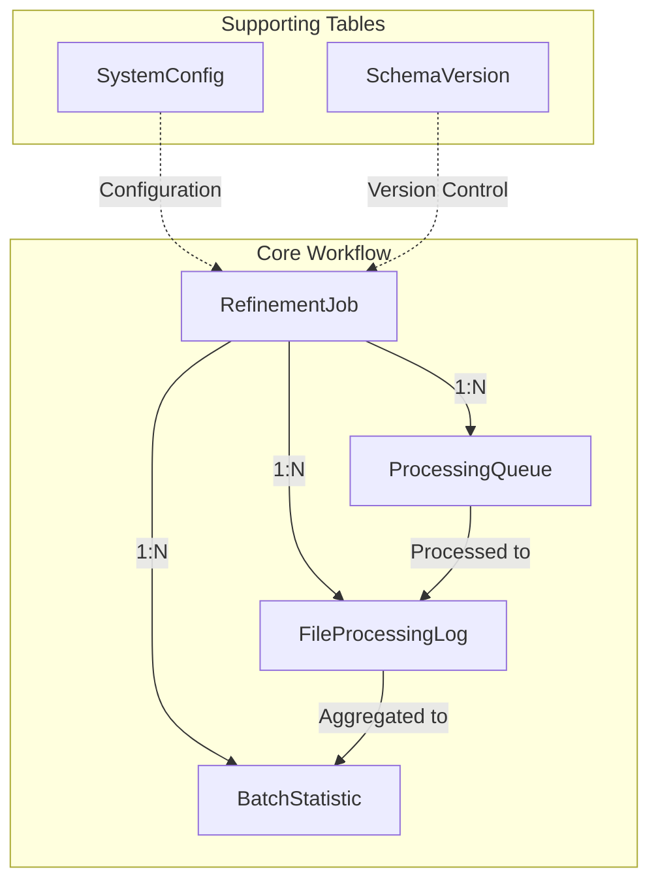
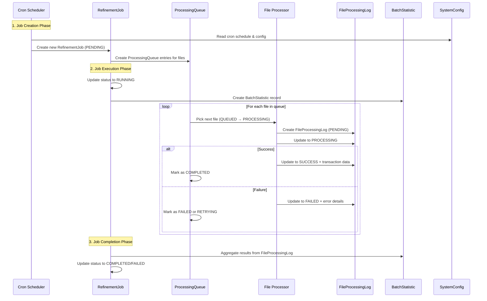

# 📊 Database Schema & Data Flow Documentation

## Table of Contents
- [System Overview](#system-overview)
- [Database Tables](#database-tables)
- [Table Relationships](#table-relationships)
- [Data Flow Process](#data-flow-process)
- [Insert Order & Workflow](#insert-order--workflow)
- [Key Patterns](#key-patterns)
- [Common Queries](#common-queries)

---

## System Overview

The database schema is designed to transform the batch refinement system from a **CLI tool** to a **long-running service** with:

- **Cron job scheduling** instead of manual execution
- **Database storage** instead of file logging
- **Job queue management** with retry mechanisms
- **Real-time monitoring** and statistics collection

### Architecture Goals
- **High throughput processing** with concurrent file handling
- **Fault tolerance** with comprehensive retry mechanisms
- **Real-time monitoring** with performance metrics
- **Scalability** with proper indexing and optimization

---

## Database Tables

### 🔹 **RefinementJob** (Primary Job Management Table)
**Purpose**: Manages refinement jobs, both scheduled and manual

| Field | Type | Description |
|-------|------|-------------|
| `id` | String (CUID) | Unique job identifier |
| `jobName` | String | Human-readable job name |
| `jobType` | Enum | Type of job (SCHEDULED_BATCH, RANGE_BASED, etc.) |
| `cronSchedule` | String? | Cron expression for scheduled jobs |
| `startFileId/endFileId` | Int? | File ID range for processing |
| `batchSize` | Int | Number of files to process in each batch |
| `status` | Enum | Current job status (PENDING → RUNNING → COMPLETED) |
| `priority` | Int | Job priority (1-10, higher = more important) |
| `maxRetries/retryCount` | Int | Retry configuration |
| `metadata` | JSON | Flexible metadata storage |

**Job Types**:
- `SCHEDULED_BATCH`: Automated cron jobs (e.g., daily at 2 AM)
- `RANGE_BASED`: Process files from ID X to Y
- `CLEANUP`: Clean up old logs and data
- `HEALTH_CHECK`: System health monitoring
- `MANUAL`: Manually triggered jobs

### 🔹 **FileProcessingLog** (Individual File Processing Records)
**Purpose**: Replaces file logging, stores refinement results for each file

| Field | Type | Description |
|-------|------|-------------|
| `jobId` | String | Reference to parent RefinementJob |
| `fileId` | Int | File ID being processed |
| `status` | Enum | Processing status (PENDING → PROCESSING → SUCCESS/FAILED) |
| `processingTimeMs` | Int | Time taken to process file |
| `ipfsHash` | String | IPFS hash of processed file |
| `encryptedEek` | String | Encrypted encryption key |
| `gasUsed` | BigInt | Blockchain gas consumption |
| `transactionHash` | String | Blockchain transaction hash |
| `refinementApiResponse` | JSON | Complete API response |
| `errorDetails` | JSON | Detailed error information |

**Processing Status Flow**:
```
PENDING → PROCESSING → SUCCESS/FAILED/SKIPPED/ALREADY_REFINED
```

### 🔹 **ProcessingQueue** (Queue Management)
**Purpose**: Manages file processing queue with priority and retry logic

| Field | Type | Description |
|-------|------|-------------|
| `jobId` | String | Reference to parent job |
| `fileId` | Int | File to be processed |
| `queuePosition` | Int | Position in processing queue |
| `status` | Enum | Queue status (QUEUED → PROCESSING → COMPLETED) |
| `priority` | Int | Processing priority |
| `attempts/maxAttempts` | Int | Retry attempt tracking |
| `nextAttemptAt` | DateTime | When to retry if failed |
| `processingNode` | String | Which worker node is processing |

**Key Features**:
- **Unique constraint** on (jobId, fileId) prevents duplicate processing
- **Priority-based** processing with load balancing
- **Retry mechanism** with exponential backoff

### 🔹 **BatchStatistic** (Analytics & Reporting)
**Purpose**: Aggregated statistics for each batch processing job

| Field | Type | Description |
|-------|------|-------------|
| `jobId` | String | Reference to parent job |
| `totalFiles` | Int | Total files in batch |
| `processedCount` | Int | Number of files processed |
| `successCount/failedCount` | Int | Success/failure counters |
| `alreadyRefinedCount` | Int | Files already processed |
| `skippedCount` | Int | Files skipped |
| `totalProcessingTimeMs` | BigInt | Total processing time |
| `averageProcessingTimeMs` | Int | Average time per file |
| `totalGasUsed` | BigInt | Total blockchain gas consumed |
| `batchStartTime/batchEndTime` | DateTime | Batch timing |

**Analytics Features**:
- **Real-time aggregation** from FileProcessingLog
- **Performance metrics** for monitoring
- **Business metrics** for reporting

### 🔹 **SystemConfig** (Configuration Management)
**Purpose**: Replaces config files, manages dynamic configuration

| Field | Type | Description |
|-------|------|-------------|
| `key` | String (PK) | Configuration key |
| `value` | String | Configuration value |
| `dataType` | Enum | Value type (STRING, INTEGER, BOOLEAN, JSON) |
| `description` | String | Human-readable description |
| `isEncrypted` | Boolean | Whether value is encrypted |
| `updatedBy` | String | Who last updated |

**Configuration Examples**:
```
processing.batch_size = 10
processing.max_concurrent_jobs = 5
cron.batch_processing = "0 */6 * * *"
api.refinement_base_url = "https://api.example.com"
features.auto_retry = true
```

### 🔹 **SchemaVersion** (Database Versioning)
**Purpose**: Tracks database migrations and schema changes

| Field | Type | Description |
|-------|------|-------------|
| `version` | String (PK) | Schema version identifier |
| `description` | String | Migration description |
| `appliedAt` | DateTime | When migration was applied |

---

## Table Relationships



**Relationship Types**:
- **One-to-Many**: Each RefinementJob has multiple FileProcessingLogs, BatchStatistics, and ProcessingQueue entries
- **Cascade Delete**: When a RefinementJob is deleted, all related records are automatically removed
- **Aggregation**: BatchStatistic is calculated from FileProcessingLog data
- **Configuration**: SystemConfig provides runtime configuration for jobs

---

## Data Flow Process



### Processing Phases

1. **Job Creation Phase**
   - Cron scheduler reads SystemConfig for schedules
   - Creates new RefinementJob with PENDING status
   - Populates ProcessingQueue with files to process

2. **Job Execution Phase**
   - Updates job status to RUNNING
   - Creates initial BatchStatistic record
   - Processes files from queue in priority order
   - Updates FileProcessingLog for each file

3. **Job Completion Phase**
   - Aggregates results into BatchStatistic
   - Updates job status to COMPLETED/FAILED
   - Schedules next job if applicable

---

## Insert Order & Workflow

### Step 1: System Initialization
```sql
-- Insert SystemConfig (Application startup)
INSERT INTO system_config (key, value, description, data_type)
VALUES 
    ('processing.batch_size', '10', 'Default batch size', 'INTEGER'),
    ('cron.batch_processing', '0 */6 * * *', 'Every 6 hours', 'STRING'),
    ('processing.max_concurrent_jobs', '5', 'Max concurrent jobs', 'INTEGER');

-- Insert SchemaVersion (Migration)
INSERT INTO schema_version (version, description)
VALUES ('1.0.0', 'Initial schema with Prisma setup');
```

### Step 2: Job Creation (Cron trigger or Manual)
```sql
-- Create RefinementJob
INSERT INTO refinement_jobs (
    id, job_name, job_type, cron_schedule, 
    start_file_id, end_file_id, batch_size, 
    status, priority, created_by
)
VALUES (
    'cuid_12345', 'daily-batch-refinement', 'SCHEDULED_BATCH', 
    '0 2 * * *', 1000, 900, 10, 
    'PENDING', 8, 'system'
);
```

### Step 3: Queue Population
```sql
-- Create ProcessingQueue entries (for each file to process)
INSERT INTO processing_queue (
    id, job_id, file_id, queue_position, 
    status, priority, scheduled_at
)
VALUES 
    ('queue_1', 'cuid_12345', 1000, 1, 'QUEUED', 8, NOW()),
    ('queue_2', 'cuid_12345', 999, 2, 'QUEUED', 8, NOW()),
    ('queue_3', 'cuid_12345', 998, 3, 'QUEUED', 8, NOW());
```

### Step 4: Job Execution Start
```sql
-- Update RefinementJob status
UPDATE refinement_jobs 
SET status = 'RUNNING', started_at = NOW()
WHERE id = 'cuid_12345';

-- Create initial BatchStatistic
INSERT INTO batch_statistics (
    id, job_id, batch_start_file_id, batch_end_file_id,
    total_files, batch_start_time
)
VALUES (
    'batch_1', 'cuid_12345', 1000, 900, 
    101, NOW()
);
```

### Step 5: File Processing
```sql
-- Update queue when starting file processing
UPDATE processing_queue 
SET status = 'PROCESSING', started_at = NOW()
WHERE id = 'queue_1';

-- Create FileProcessingLog entry
INSERT INTO file_processing_logs (
    id, job_id, file_id, status, message, created_at
)
VALUES (
    'log_1', 'cuid_12345', 1000, 'PENDING', 'Starting refinement', NOW()
);

-- Update to processing status
UPDATE file_processing_logs
SET status = 'PROCESSING', message = 'Calling refinement API'
WHERE id = 'log_1';
```

### Step 6: Result Handling

#### Success Case
```sql
UPDATE file_processing_logs
SET 
    status = 'SUCCESS',
    message = 'File successfully refined',
    processing_time_ms = 2500,
    ipfs_hash = 'QmYwAPJzv5CZsnA625s3Xf2nemtYgPpHdWEz79ojWnPbdG',
    gas_used = 123456,
    transaction_hash = '0x1234567890abcdef...',
    refinement_api_response = '{"status": "success", "file_id": 1000}',
    processed_at = NOW()
WHERE id = 'log_1';

UPDATE processing_queue
SET status = 'COMPLETED', completed_at = NOW()
WHERE id = 'queue_1';
```

#### Failure Case
```sql
UPDATE file_processing_logs
SET 
    status = 'FAILED',
    message = 'API timeout during refinement',
    error_details = '{"error_code": "TIMEOUT", "details": "Connection timeout after 30 seconds", "retry_suggested": true}',
    processing_time_ms = 30000,
    processed_at = NOW()
WHERE id = 'log_1';

UPDATE processing_queue
SET 
    status = 'RETRYING', 
    attempts = attempts + 1,
    next_attempt_at = NOW() + INTERVAL '5 minutes',
    error_message = 'API timeout during refinement'
WHERE id = 'queue_1';
```

### Step 7: Job Completion
```sql
-- Aggregate results into BatchStatistic
UPDATE batch_statistics
SET 
    processed_count = (SELECT COUNT(*) FROM file_processing_logs WHERE job_id = 'cuid_12345'),
    success_count = (SELECT COUNT(*) FROM file_processing_logs WHERE job_id = 'cuid_12345' AND status = 'SUCCESS'),
    failed_count = (SELECT COUNT(*) FROM file_processing_logs WHERE job_id = 'cuid_12345' AND status = 'FAILED'),
    total_processing_time_ms = (SELECT COALESCE(SUM(processing_time_ms), 0) FROM file_processing_logs WHERE job_id = 'cuid_12345'),
    average_processing_time_ms = (SELECT COALESCE(AVG(processing_time_ms), 0) FROM file_processing_logs WHERE job_id = 'cuid_12345'),
    total_gas_used = (SELECT COALESCE(SUM(gas_used), 0) FROM file_processing_logs WHERE job_id = 'cuid_12345'),
    batch_end_time = NOW()
WHERE job_id = 'cuid_12345';

-- Complete the job
UPDATE refinement_jobs
SET 
    status = 'COMPLETED',
    completed_at = NOW()
WHERE id = 'cuid_12345';
```

---

## Key Patterns

### 🔄 Retry Mechanism
**Multi-level retry system**:
- **Job Level**: `retryCount`, `maxRetries`, `nextRetryAt` for entire job retry
- **File Level**: `attempts`, `maxAttempts`, `nextAttemptAt` for individual file retry
- **Exponential Backoff**: Delay increases with each retry attempt

```typescript
// Retry delay calculation
const retryDelay = baseDelay * Math.pow(2, attemptNumber - 1);
```

### 📊 Real-time Aggregation
**Continuous statistics updates**:
- BatchStatistic is updated as files are processed
- Aggregation queries run against FileProcessingLog
- Performance metrics calculated in real-time

### 🔍 Query Optimization
**Strategic indexing**:
- **20+ indexes** for frequent query patterns
- **Composite indexes** for complex filters (status + priority)
- **Foreign key indexes** for efficient joins
- **Timestamp indexes** for time-range queries

### 🔒 Data Integrity
**Comprehensive constraints**:
- **Unique constraints**: Prevent duplicate processing (jobId + fileId)
- **Foreign keys**: Ensure referential integrity
- **Cascade deletes**: Automatic cleanup of related data
- **Enum constraints**: Ensure valid status values
- **NOT NULL constraints**: Ensure required fields

### 📈 Performance Optimization
**Scalability features**:
- **CUID primary keys** for distributed systems
- **JSON fields** for flexible metadata without schema changes
- **BigInt fields** for large numbers (gas usage, processing times)
- **Partial indexes** for status-specific queries

---

## Common Queries

### Job Management
```sql
-- Get currently running jobs
SELECT * FROM refinement_jobs 
WHERE status = 'RUNNING'
ORDER BY priority DESC, started_at ASC;

-- Find jobs that need retry
SELECT * FROM refinement_jobs 
WHERE status = 'RETRYING' 
AND next_retry_at <= NOW()
ORDER BY priority DESC;

-- Get job performance summary
SELECT 
    rj.job_name,
    rj.status,
    rj.created_at,
    rj.started_at,
    rj.completed_at,
    bs.total_files,
    bs.success_count,
    bs.failed_count,
    bs.average_processing_time_ms,
    bs.total_gas_used
FROM refinement_jobs rj
LEFT JOIN batch_statistics bs ON rj.id = bs.job_id
WHERE rj.created_at >= NOW() - INTERVAL '24 hours'
ORDER BY rj.created_at DESC;
```

### Queue Management
```sql
-- Get next files to process (priority queue)
SELECT pq.*, rj.job_name, rj.priority as job_priority
FROM processing_queue pq
JOIN refinement_jobs rj ON pq.job_id = rj.id
WHERE pq.status = 'QUEUED'
AND rj.status = 'RUNNING'
ORDER BY pq.priority DESC, pq.scheduled_at ASC
LIMIT 10;

-- Find files that need retry
SELECT * FROM processing_queue
WHERE status = 'RETRYING'
AND next_attempt_at <= NOW()
AND attempts < max_attempts
ORDER BY priority DESC, next_attempt_at ASC;

-- Queue health check
SELECT 
    status,
    COUNT(*) as count,
    AVG(EXTRACT(EPOCH FROM (NOW() - scheduled_at))) as avg_wait_seconds
FROM processing_queue
WHERE created_at >= NOW() - INTERVAL '1 hour'
GROUP BY status;
```

### Analytics & Monitoring
```sql
-- System performance overview
SELECT 
    DATE(created_at) as date,
    COUNT(*) as total_jobs,
    SUM(CASE WHEN status = 'COMPLETED' THEN 1 ELSE 0 END) as completed_jobs,
    SUM(CASE WHEN status = 'FAILED' THEN 1 ELSE 0 END) as failed_jobs,
    AVG(EXTRACT(EPOCH FROM (completed_at - started_at))) as avg_duration_seconds
FROM refinement_jobs
WHERE created_at >= NOW() - INTERVAL '7 days'
GROUP BY DATE(created_at)
ORDER BY date DESC;

-- File processing success rate
SELECT 
    status,
    COUNT(*) as count,
    ROUND(COUNT(*) * 100.0 / SUM(COUNT(*)) OVER (), 2) as percentage
FROM file_processing_logs
WHERE created_at >= NOW() - INTERVAL '24 hours'
GROUP BY status
ORDER BY count DESC;

-- Gas usage analysis
SELECT 
    DATE(processed_at) as date,
    COUNT(*) as files_processed,
    SUM(gas_used) as total_gas,
    AVG(gas_used) as avg_gas_per_file,
    MIN(gas_used) as min_gas,
    MAX(gas_used) as max_gas
FROM file_processing_logs
WHERE status = 'SUCCESS'
AND processed_at >= NOW() - INTERVAL '7 days'
GROUP BY DATE(processed_at)
ORDER BY date DESC;
```

### Configuration Management
```sql
-- Get all configuration
SELECT key, value, description, data_type, updated_at
FROM system_config
ORDER BY key;

-- Get cron job configurations
SELECT key, value, description
FROM system_config
WHERE key LIKE 'cron.%'
ORDER BY key;

-- Update configuration
UPDATE system_config
SET value = '20', updated_at = NOW(), updated_by = 'admin'
WHERE key = 'processing.batch_size';
```

---

## Performance Considerations

### Index Strategy
- **Primary indexes** on frequently queried fields (status, created_at)
- **Composite indexes** for common filter combinations
- **Partial indexes** for specific status values
- **Foreign key indexes** for join operations

### Data Archival
- **Partition tables** by date for large datasets
- **Archive old logs** to separate tables
- **Cleanup policies** for completed jobs
- **Retention periods** based on business requirements

### Monitoring Queries
- **Active job count** and status distribution
- **Queue depth** and processing rate
- **Error rate** and failure patterns
- **Performance metrics** and trends

This database schema provides a robust foundation for high-throughput batch processing with comprehensive monitoring, retry mechanisms, and performance optimization. 🚀 